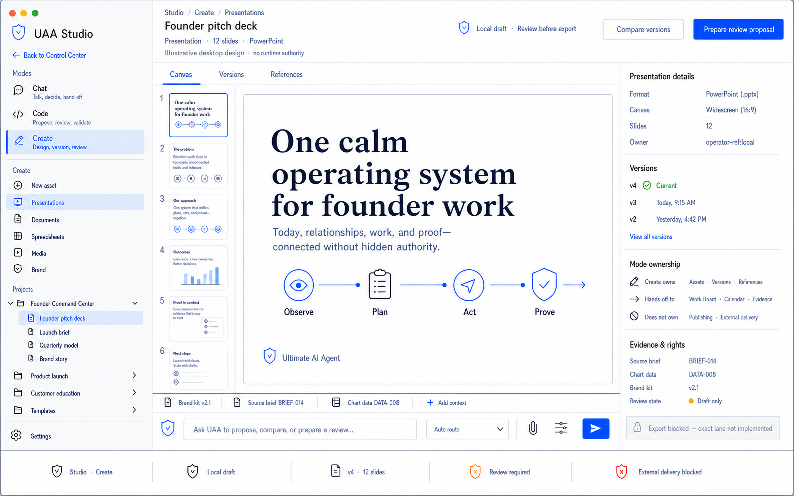

# Studio Tab Product Direction

Status: accepted north-star design direction, documentation and renders only

Decision date: 2026-07-13

Repository baseline: v0.104.0 / 0.104.0

This decision defines the target purpose, information architecture, and visual
grammar for the Control Center `Studio` tab. It does not add routes, runtime
behavior, model calls, shell authority, connector access, export execution,
publishing, or production readiness.

## Decision

The global product rail keeps one `Studio` entry. Inside it, the operator works
in one shared `UAA Studio` shell with exactly three persistent modes:

1. **Chat** — talk, decide, and hand off.
2. **Code** — propose, review, and validate.
3. **Create** — design, version, and review.

These are modes of one workspace, not separate Studio products or global
navigation items. The UAA Studio identity, pane geometry, composer, safe-ref
model, review posture, evidence vocabulary, and authority boundaries stay
constant when the operator changes modes. Only the mode-local navigation,
center work surface, and inspector context change.

Studio should reopen the last-used mode when safe to do so. The persistent mode
switcher belongs at the top of the Studio rail. Future deep links may preserve
mode-local selection, but the current route registry remains implementation
truth until separately changed and tested.

## Specific Purpose And Ownership

| Mode | Specific purpose | Owns | Does not own |
|---|---|---|---|
| Chat | Turn conversation and attached safe refs into understanding, decisions to review, and explicit handoffs. | thread history, attached context refs, summaries, proposed plan/action/memory/artifact handoffs | Work Board state, CRM truth, committed calendar events, external messages, approvals, or execution authority |
| Code | Turn an operator request into an inspectable repo-local proposal with edits, diffs, checks, terminal posture, and proof before apply. | project/task context, proposed patches, change review, validation results, bounded terminal lanes, code evidence | unrestricted shell, deploy authority, model authority, approval minting, or product-planning truth |
| Create | Turn a brief and governed source refs into a versioned presentation, document, spreadsheet, media asset, or brand artifact ready for review. | local draft assets, slide/page/sheet structure, versions, variants, references, brand context, rights, review handoff | social interpretation, production scheduling, external publishing, connector delivery, or silent export |

`Create` is the place to make a PowerPoint. `Presentations` is a first-class
Create view alongside `Documents`, `Spreadsheets`, `Media`, and `Brand`.
`Export .pptx` remains visibly unavailable until a separately implemented and
approved local export lane exists.

## Shared Interaction Contract

All three modes use the same clean immersive workbench:

- fixed 220 px Studio rail;
- exactly three 44 px mode rows with visible scope copy;
- mode-local navigation below one straight separator;
- flexible central conversation, editor, or asset canvas;
- fixed 350 px contextual inspector;
- 96 px slide-thumbnail strip inside Create when presentations are active;
- straight one-pixel shared pane separators;
- docked two-row UAA composer attached to the center pane;
- full-width bottom status band;
- maximum 8 px corner radius, used sparingly;
- rectangular commands and plain status rows instead of pill-heavy chrome;
- no floating drawers, clipped boxes, overlapping panes, or nested card stacks;
- a visible `Back to Control Center` command and fixed Settings access.

The center pane remains the dominant work surface. The inspector explains the
selected conversation context, change, check, asset, version, source, rights,
review, or evidence state without becoming a second workspace.

### Mode-local rail content

- Chat: new conversation, threads, decisions, and handoffs.
- Code: new task, projects, code review, pull requests, and governed terminal.
- Create: new asset, presentations, documents, spreadsheets, media, brand,
  projects, and templates.

## Canonical Owners And Handoffs

Studio produces drafts, artifacts, proposals, and proof; it does not duplicate
durable truth owned by other modules.

| Concern | Canonical owner | Studio relationship |
|---|---|---|
| Work status and production sequence | Work Board | links task/card refs and returns conversation, code, or asset review state |
| Relationship context and follow-up | CRM | consumes bounded relationship refs; does not copy the CRM record |
| Time and deadlines | Calendar | links review slots and deadlines; does not create a second schedule |
| External conversations and replies | Communications / Messenger | Chat or Create may prepare a draft handoff; Studio does not send directly |
| Social performance and audience signals | Social Media Intelligence | Create may consume a reviewed insight ref; Social retains interpretation ownership |
| Decisions, receipts, and proof | Action Inbox / Activity & Trust / Evidence | records review, apply, export, rollback, and delivery evidence when exact lanes exist |

Cross-mode and cross-module handoffs use backend-owned identifiers and governed
envelopes, not copied React state. Switching among Chat, Code, and Create does
not grant additional authority.

## Truth And Authority

- A visible mode or button is not proof that an action is implemented or
  completed.
- Chat produces explanations and proposals; model output is not authority.
- Code changes remain proposed until exact apply authority and approval are
  validated; checks and diffs are evidence, not authority.
- Create assets remain local drafts until review state is backend-owned.
- Local export, external delivery, publishing, deploy, and connector writes are
  separate exact lanes. None are granted by this decision.
- `Exported`, `published`, `sent`, `deployed`, and `complete` require applicable
  receipt-backed result state.
- Renders use illustrative safe refs and must not expose raw paths, prompts,
  provider payloads, private content, credentials, usernames, or logs.

## Accepted Screen

### Unified Studio v7 — Create mode

This screen locks the single Studio identity, persistent Chat/Code/Create mode
switcher, narrow rail, dominant center canvas, mode-ownership inspector, docked
proposal composer, fail-closed export posture, and full-width status band.
Create is active to prove that
presentations and other creative assets fit inside the same shell as Chat and
Code without becoming a separate product.

The earlier coding-only and creative-only screens remain preserved comparison
artifacts in the render manifest and gallery history. They no longer define
separate current Studio workspaces.

Generated pixels remain directional. This contract and the canonical shell/UI
specifications win if a label, spacing detail, or illustrative state conflicts
with repository truth.

### Accepted Create sub-surface — Skill Workbench

The accepted Skill Workbench grid and default dense list are preserved as
`control_center_north_star/renders/target-v3/07-skill-workbench-grid-v1.png`
and
`control_center_north_star/renders/target-v3/08-skill-workbench-list-v1.png`.
The implemented `/studio/skills` slice uses a backend-owned sanitized metadata
snapshot, 25-row pagination, source-specific popularity fields, and an
inspector that says risk is not assessed. The list uses source license data in
place of a speculative risk badge. Live marketplace fetch, saving, adaptation,
import, enablement, and execution remain blocked or unimplemented.

## Implementation Direction

Later implementation should proceed as separately scoped work:

1. preserve one global Studio navigation item and define backend-owned durable
   selection for exactly `chat`, `code`, and `create`;
2. implement the shared fixed-pane shell and narrow macOS desktop fallback;
3. bind Chat to existing conversation and governed handoff contracts;
4. bind Code to existing Coding, checks, terminal-posture, and evidence
   contracts;
5. add Create contracts for local draft assets and version metadata without
   external delivery;
6. promote exact review, apply, local export, deploy, or external-delivery lanes
   only with policy, approval, idempotency, redaction, rollback, receipt,
   CLI/API parity, route classification, OpenAPI, and focused verifier coverage.

This document is the accepted direction, not implementation authorization.
Mobile implementation and mobile renders are deferred until a separately
accepted porting milestone.
