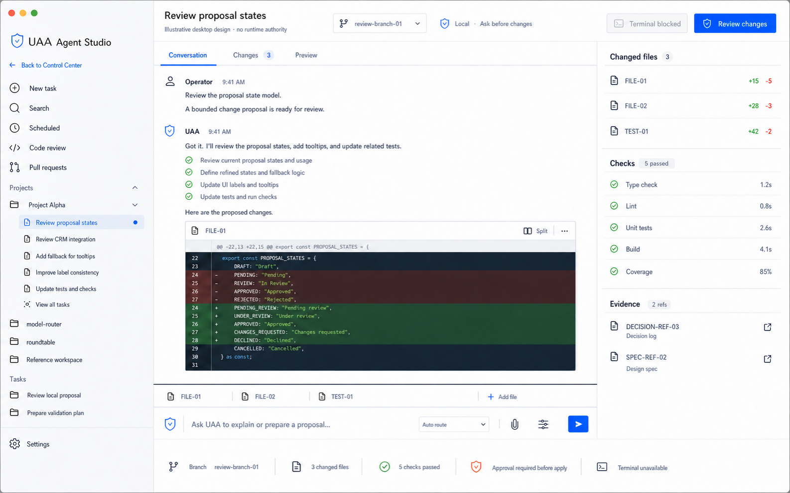
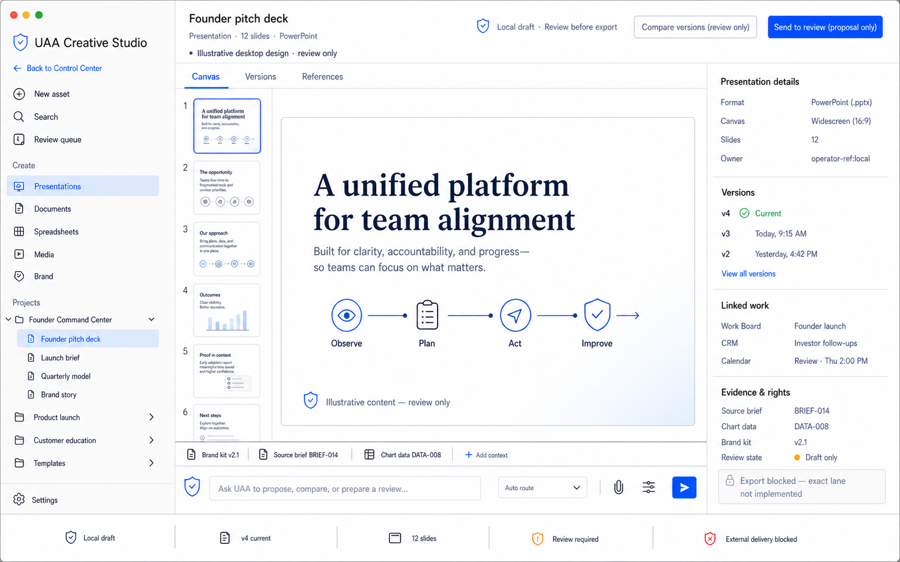

# Studio Tab Product Direction

Status: accepted north-star design direction, documentation and renders only

Decision date: 2026-07-13

Repository baseline: v0.104.0 / 0.104.0

This decision defines the target purpose, information architecture, and visual
grammar for the Control Center `Studio` tab. It does not add routes, runtime
behavior, model calls, shell authority, connector access, export execution,
publishing, or production readiness.

## Decision

The global product rail keeps one `Studio` entry. Inside that immersive entry,
the operator works in one of two explicit workspaces:

1. **Agent Studio** for reasoning about and changing software.
2. **Creative Studio** for producing and reviewing versioned business assets.

This is a purposeful split, not two unrelated products. Both workspaces share
the same desktop geometry, UAA composer, safe-reference model, review posture,
and evidence vocabulary. They differ in the artifact being produced and the
controls required to inspect it.

Studio should reopen the last-used workspace when safe to do so. A workspace
switcher belongs in the Studio identity rail or command search, never as two
additional global navigation items. Future deep links may distinguish Agent
and Creative workspace state, but the current route registry remains
implementation truth until separately changed and tested.

## Specific Purpose

| Workspace | Specific purpose | Owns | Does not own |
|---|---|---|---|
| Agent Studio | Turn an operator request into an inspectable repo-local task with conversation, proposed edits, diffs, checks, terminal lanes, and proof before apply. | agent tasks, project/thread context, change review, validation results, terminal posture, code evidence | unrestricted shell, deploy authority, model authority, approval minting, product planning truth |
| Creative Studio | Turn a brief and governed source refs into a versioned presentation, document, spreadsheet, media asset, or brand artifact ready for review and a later exact export lane. | asset canvas, slide/page/sheet structure, versions, variants, references, brand context, rights, review handoff | social performance interpretation, production scheduling, conversations, external publishing, connector delivery, silent export |

Creative Studio is the target place to make a PowerPoint. `Presentations` is a
first-class creation mode alongside `Documents`, `Spreadsheets`, `Media`, and
`Brand`. The accepted render shows PowerPoint as the active artifact format,
while `Export .pptx` remains visibly unavailable until a separately implemented
and approved local export lane exists.

## Shared Interaction Contract

Both workspaces use the same clean immersive workbench:

- fixed 250 px identity/project rail;
- flexible central transcript, editor, or asset canvas;
- fixed 350 px contextual inspector;
- straight one-pixel shared pane separators;
- docked two-row UAA composer attached to the center pane;
- full-width bottom status band;
- maximum 8 px corner radius, used sparingly;
- rectangular commands and plain status rows instead of pill-heavy chrome;
- no floating drawers, clipped boxes, overlapping panes, or nested card stacks;
- a visible `Back to Control Center` command and fixed Settings access.

The center pane remains the dominant work surface. The inspector explains the
selected task, change, asset, version, source, rights, review, or evidence state
without becoming a second workspace.

## Ownership And Handoffs

Studio produces artifacts and proposals; it does not duplicate durable truth
owned by other modules.

| Concern | Canonical owner | Studio relationship |
|---|---|---|
| Work status and production sequence | Work Board | links the task/card by safe ref and returns review-ready artifact state |
| Relationship context and follow-up | CRM | consumes bounded relationship refs; does not copy the CRM record |
| Time and deadlines | Calendar | links review slots and deadlines; does not create a second schedule |
| Conversations and external replies | Communications / Messenger | prepares drafts or handoffs; does not send directly |
| Social performance and audience signals | Social Media Intelligence | Creative Studio may use a reviewed insight ref; Social retains interpretation ownership |
| Receipts, decisions, and proof | Activity & Trust / Evidence | records review, apply, export, rollback, and delivery evidence when exact lanes exist |

Cross-workspace handoffs use backend-owned identifiers and governed envelopes,
not copied React state. Moving an item between Agent and Creative Studio does
not grant additional authority.

## Truth And Authority

- A visible button is not proof that an action is implemented or completed.
- Agent changes remain proposed until exact apply authority and approval are
  validated; checks and diffs are evidence, not authority.
- Creative assets remain local drafts until review state is backend-owned.
- Local export, external delivery, publishing, and connector writes are
  separate exact lanes. None are granted by this decision.
- `Exported`, `published`, `sent`, `deployed`, and `complete` require applicable
  receipt-backed result state.
- Renders use fictional safe refs and must not expose raw paths, prompts,
  provider payloads, private content, credentials, or logs.

## Accepted Screens

### Agent Studio v5

This screen locks the shared geometry and the coding-agent workflow: project
rail, conversation and diff, changed-files/checks/evidence inspector, docked
composer, and bottom authority/status band.

### Creative Studio v2

This screen locks the creative workflow: creation modes, slide strip, dominant
asset canvas, presentation metadata, versions, linked work, rights, governed
review, and visibly blocked export.

Generated pixels remain directional. This contract and the canonical shell/UI
specifications win if a label, spacing detail, or illustrative state conflicts
with repository truth.

## Implementation Direction

Later implementation should proceed as separately scoped work:

1. preserve one global Studio navigation item and define backend-owned workspace
   identity and durable selection;
2. implement the shared fixed-pane shell and a narrow macOS desktop fallback;
3. bind Agent Studio to existing Chat, Coding, checks, and evidence contracts;
4. add Creative Studio read/write contracts for local draft assets and version
   metadata without external delivery;
5. promote exact review, local export, and external-delivery lanes only with
   policy, approval, idempotency, redaction, rollback, receipt, CLI/API parity,
   route classification, OpenAPI, and focused verifier coverage.

This document is the accepted direction, not implementation authorization.
Mobile implementation and mobile renders are deferred until a separately
accepted porting milestone.
