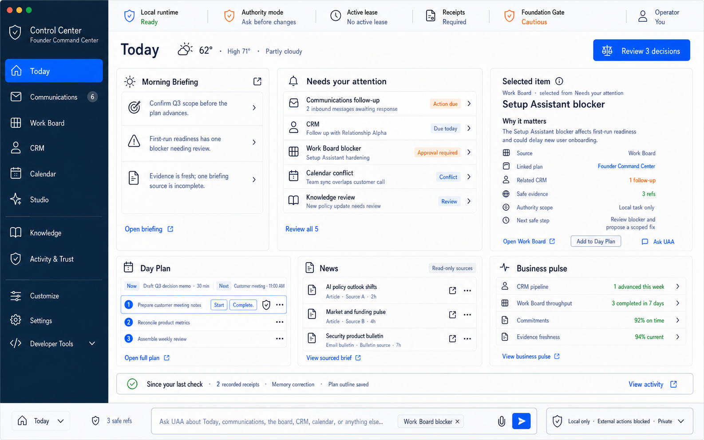
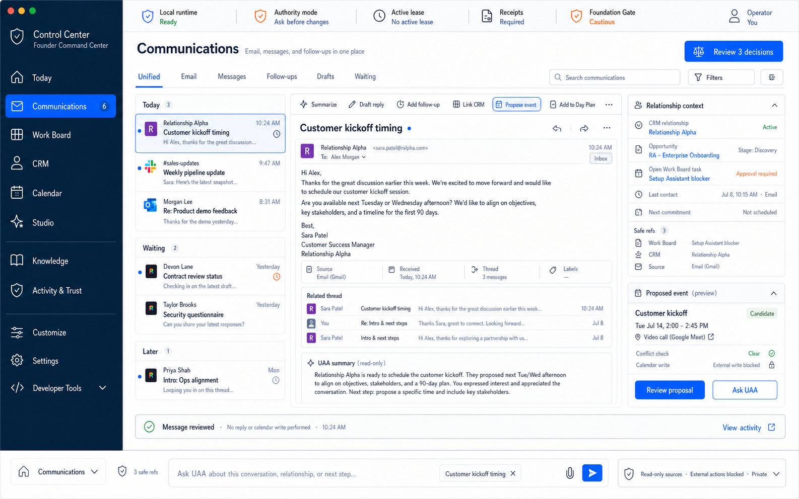
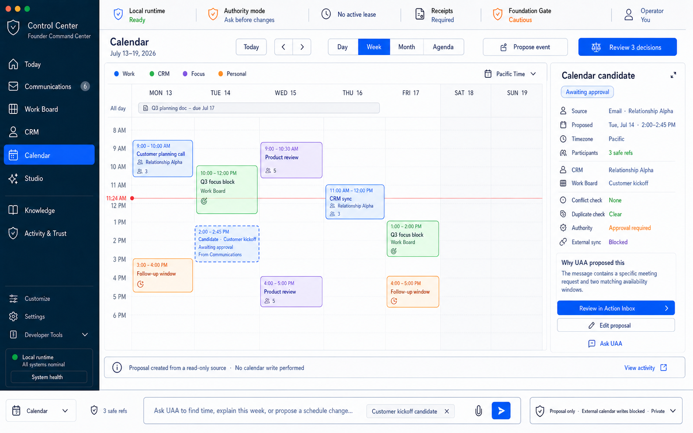
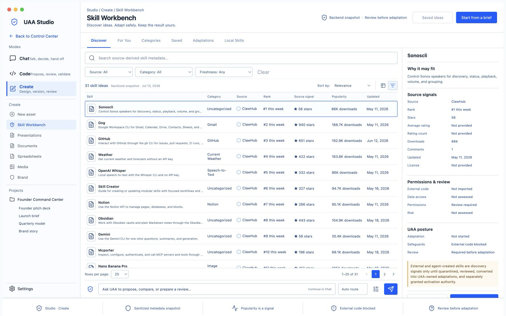
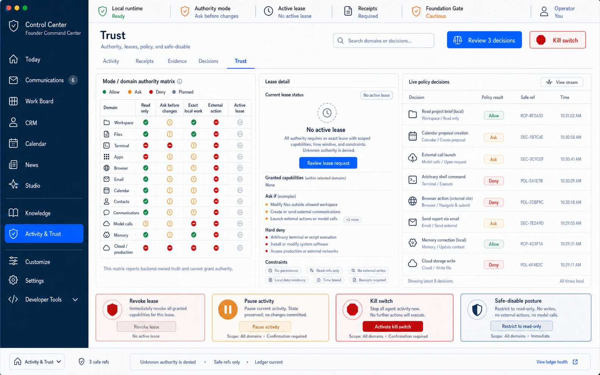

# Control Center North-Star Visual Renders

Status: current target render set, documentation only.
Baseline ID: CC-NS-TARGET-R6-2026-07-13.
Current as of: 2026-07-13.
Repo baseline: v0.104.0 / 0.104.0.

Machine-readable currentness: `CURRENT_RENDER_BASELINE.json`.

These renders define the desired visual direction for the Control Center as a
contained operator cockpit. They are not shipped UI evidence, runtime behavior,
route proof, authority grant, public beta claim, or production readiness claim.

The canonical rules extracted from this directional set now live in
`../CONTROL_CENTER_UI_UX_SPEC.md` (`CC-UIUX-2026-07-13`). That specification
wins when the generated PNGs disagree with each other. The complete next-render
queue, including all 42 current routed surfaces and applicable state/responsive
variations, lives in `RENDER_VARIATION_MATRIX.md`. The consolidated target
surface architecture is defined by
`../CONTROL_CENTER_PRODUCT_IA_AND_CALENDAR_CONTRACT.md`. The accepted purpose,
ownership, and geometry of the unified Chat / Code / Create Studio are defined
by `../STUDIO_TAB_PRODUCT_DIRECTION.md`.

The package is meant to remove ambiguity before implementation. Each render is
a bounded desktop-app target for one or more Control Center surfaces, with the
route coverage recorded in `SURFACE_COVERAGE.md`.

## Currentness Contract

`CURRENT_RENDER_BASELINE.json` is the repository-readable pointer to the
preferred review target for the current period. A `current` render is the
latest design target to critique; it is not automatically approved, shipped,
connected, or implemented. Earlier versions remain immutable comparison
artifacts. Every new preferred revision must update the baseline ID or
`current_as_of` date, its latest asset pointer, and the gallery version history
in the same commit.

The target shell source of truth is `APP_SHELL_BASELINE.md`. If a generated
render shows a different left-rail order, a missing global item, a route-local
tab in the global rail, or a typography mismatch, `APP_SHELL_BASELINE.md`
wins.

The planning-only coherent-app extension of this shell lives in
`../ecosystem_north_star/README.md`. Its reviewed SVG drafts do not replace this
baseline and are not route or implementation evidence.

## Design Posture

- The Control Center should feel like a native desktop cockpit, not a webpage.
- Every primary workflow should fit in a single application window.
- Use a fixed left navigation rail, a persistent top status/authority strip,
  bounded split panes, compact inspectors, and bottom evidence/receipt bands.
- Avoid endless scrolling, landing-page heroes, oversized marketing cards,
  decorative gradients, or raw JSON as the primary operator view.
- Guardrails should appear as useful context: active mode, required domain,
  approval state, receipt refs, audit refs, rollback/safe-disable posture, and
  blocked/planned state.
- Authority should be represented through trust mode, domain, lease,
  constraints, receipts, audit, redaction, safe-disable, and kill switch.
- Unsupported domains should be visible as unsupported, planned, draft-only, or
  blocked rather than hidden or implied as live.
- No render implies broad shell, browser, connector, provider, background, or
  production authority.

## Target Render Inventory

Every target render is a draft until explicitly approved in the local review
gallery.

| Render | Target surface |
|---|---|
| `renders/target-v1/01-today.png` | Today |
| `renders/target-v1/02-communications.png` | Communications |
| `renders/target-v1/03-work-board.png` | Work Board |
| `renders/target-v1/04-crm.png` | CRM |
| `renders/target-v1/05-calendar.png` | Calendar |
| `renders/target-v1/06-studio.png` | Studio |
| `renders/target-v1/07-knowledge.png` | Knowledge |
| `renders/target-v1/08-activity-trust.png` | Activity & Trust |
| `renders/target-v1/09-customize.png` | Customize |
| `renders/target-v1/10-settings.png` | Settings |
| `renders/target-v1/11-developer-tools.png` | Developer Tools |
| `renders/target-v1/12-decision-review.png` | Global Decision Review |
| `renders/target-v1/13-onboarding.png` | Onboarding |
| `renders/target-v1/14-uaa-sidecar.png` | Global UAA Sidecar |

Revision 02 adds non-destructive versions and new surfaces:

| Render | Revision |
|---|---|
| `renders/target-v2/03-work-board-v2.png` | Work Board v2 color grammar |
| `renders/target-v2/04-crm-v2.png` | CRM v2 governed calling placeholder |
| `renders/target-v2/06-studio-v2.png` | Studio v2 immersive workbench |
| `renders/target-v2/15-news-v1.png` | Preserved News v1 curated-workspace exploration |
| `renders/target-v2/16-trust-v1.png` | Trust v1 authority cockpit |
| `renders/target-v2/17-terminal-v1.png` | Terminal v1 governed terminal |
| `renders/target-v2/18-compact-shell-v1.png` | Compact icon-only shell v1 |

Revision 03 records the CRM refinement and preserved Studio-split explorations:

| Render | Revision |
|---|---|
| `renders/target-v3/04-crm-v3.png` | CRM v3 premier general relationship workspace |
| `renders/target-v3/06-agent-studio-v5.png` | Preserved coding-only Studio exploration with blocked terminal truth |
| `renders/target-v3/06-creative-studio-v2.png` | Preserved creative-only Studio exploration with blocked export truth |

Studio revision 05 supersedes the split as the current accepted direction:

| Render | Revision |
|---|---|
| `renders/target-v3/06-studio-unified-v7.png` | Unified Studio v7 with persistent Chat, Code, and Create modes; Create active; export blocked |
| `renders/target-v3/07-skill-workbench-grid-v1.png` | Skill Workbench Create-mode Hermes-filtered grid with honest missing source signals and review posture |
| `renders/target-v3/08-skill-workbench-list-v1.png` | Canonical Studio dense-workbench reference with complete primary values, honest source gaps, inspector detail, and pagination |

News & Signals V1 records the current safe fixture-backed desktop implementation
while preserving the earlier analytical News exploration:

| Render | Revision |
|---|---|
| `renders/news-signals-v1/01-news-signals-home.png` | Default fixture-only News & Signals preview with visible sample, safety, and deferred-control posture |
| `renders/news-signals-v1/02-news-signals-compact.png` | Compact desktop fixture preview at 1280 x 820 |
| `renders/news-signals-v1/03-news-signals-narrow-desktop.png` | Narrow desktop fixture preview at 1024 x 768 |
| `renders/news-signals-v1/04-news-signals-community-filter.png` | Community filter presentation-state proof |

See `renders/news-signals-v1/README.md` for capture metadata, implemented
interactions, and the authority boundary. These screenshots are implementation
evidence for local fixtures only, not evidence that any external source is
connected.

The independent Messenger client set covers the Element-familiar Matrix north
star through the UAA lens while Communications keeps its accepted unified hub.
Messenger is a separate immersive tab like Studio. Its two primary Spaces are
Founder HQ and Personal Circle. The surface contract is in
`UAA_COMMUNICATIONS_MATRIX_NORTH_STAR.md`; all images remain design targets.
The staged implementation sequence is in
`../UAA_MESSENGER_MATRIX_IMPLEMENTATION_PLAN.md`.

Run the one-at-a-time critique gallery with:

```bash
.venv/bin/python scripts/dev/serve_control_center_render_review.py
```

Then open `http://127.0.0.1:4179/render-review/`. Review status and notes stay
in browser local storage and can be exported/imported as JSON.

## Legacy Composite Inventory

| Render | Primary surface group |
|---|---|
| `renders/01_today_command_center.png` | Today, Morning Briefing, daily loop |
| `renders/02_action_inbox_approval_envelope.png` | Action Inbox, approval envelopes, approvals |
| `renders/03_plans_work_board.png` | Plans and Work Board |
| `renders/04_trust_authority_lease.png` | Trust and AuthorityLease cockpit |
| `renders/05_evidence_proof_receipts.png` | Evidence, Proof, Receipts |
| `renders/06_memory_review_context_manifest.png` | Memory review and context manifest |
| `renders/07_setup_runtime_readiness.png` | Setup Assistant and runtime readiness |
| `renders/08_coding_cockpit.png` | Governed Coding cockpit |
| `renders/09_source_inbox_crm_briefing_prep.png` | Source Inbox, CRM, Briefing preparation |
| `renders/10_chat_handoff.png` | Chat and loop handoff |
| `renders/11_start_overview_dashboard.png` | Start Here, Overview, Dashboard |
| `renders/12_settings_authority_profiles.png` | Settings and authority profile controls |
| `renders/13_models_readiness.png` | Models, local runtime, provider posture |
| `renders/14_files_context_proposals.png` | Files, File Review, Context Proposals |
| `renders/15_action_preview_preflight.png` | Action Preview and approval preflight |
| `renders/16_runtime_storage_manual_smoke.png` | Runtime, Storage, Local Runtime, Manual Smoke |
| `renders/17_future_domain_governance.png` | Remote Workers, Plugin Governance, Mobile Planning |
| `renders/18_private_trial_packet.png` | Trial Packet and private review |
| `renders/19_operator_loop.png` | Operator Loop and readable proof spine |
| `renders/20_api_foundation_events.png` | API Routes, Foundation Gate, Events, Differentiators |

## Current Baseline

- Current target render set: CC-NS-TARGET-R6-2026-07-13.
- Current as of: 2026-07-13.
- Machine-readable pointer: `CURRENT_RENDER_BASELINE.json`.
- Canonical shell: `APP_SHELL_BASELINE.md`.
- Route coverage: `SURFACE_COVERAGE.md`.
- Render constraints: `RENDER_MANIFEST.md`.
- Canonical UI/UX specification: `../CONTROL_CENTER_UI_UX_SPEC.md`.
- Complete render queue: `RENDER_VARIATION_MATRIX.md`.
- Local critique viewer: `render-review/README.md`.

Known generated-render limitation: the screenshots are directional UI renders,
so small sidebar text/order variations inside individual PNGs are not
normative. The global navigation and typography are governed by the shell
baseline.

## Preview Strip












## Implementation Use

When a route is redesigned, use the mapped render in `SURFACE_COVERAGE.md` as
the visual target, then preserve the repo's normal contract-first path:

- backend-owned truth for operator-critical state;
- CLI/API inspection parity for mutating or authority-relevant workflows;
- route side-effect classification;
- OpenAPI/API manifest alignment;
- redacted receipts/evidence;
- focused frontend and Python verifier coverage.

If implementation diverges from a render, update this package or record the
accepted reason in the relevant route docs. Do not let visual assets become
stale hidden requirements.
