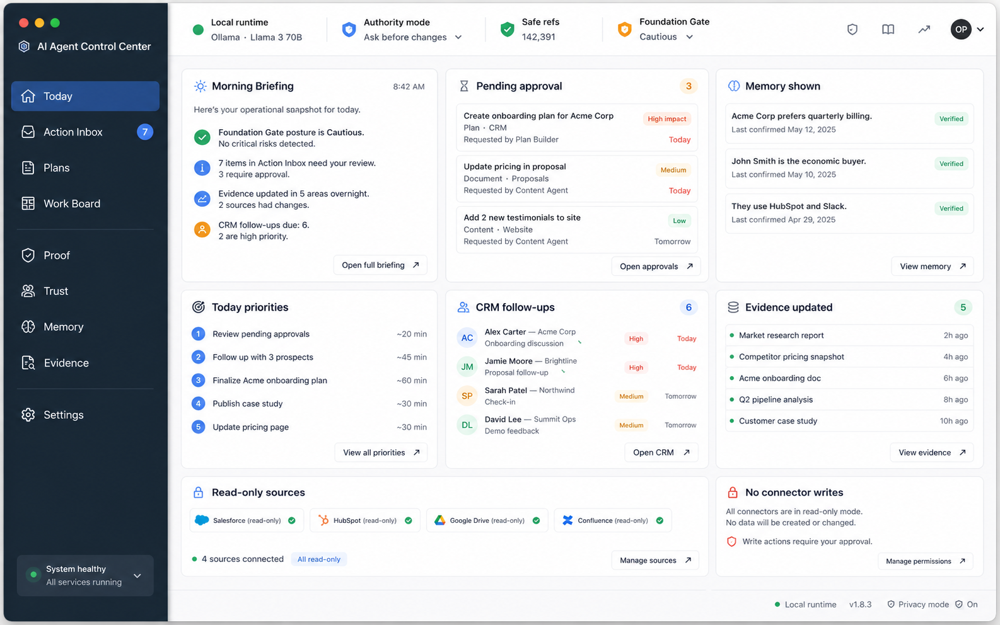
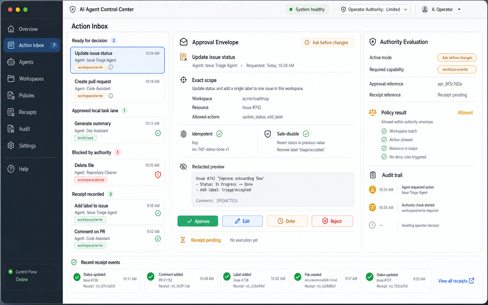
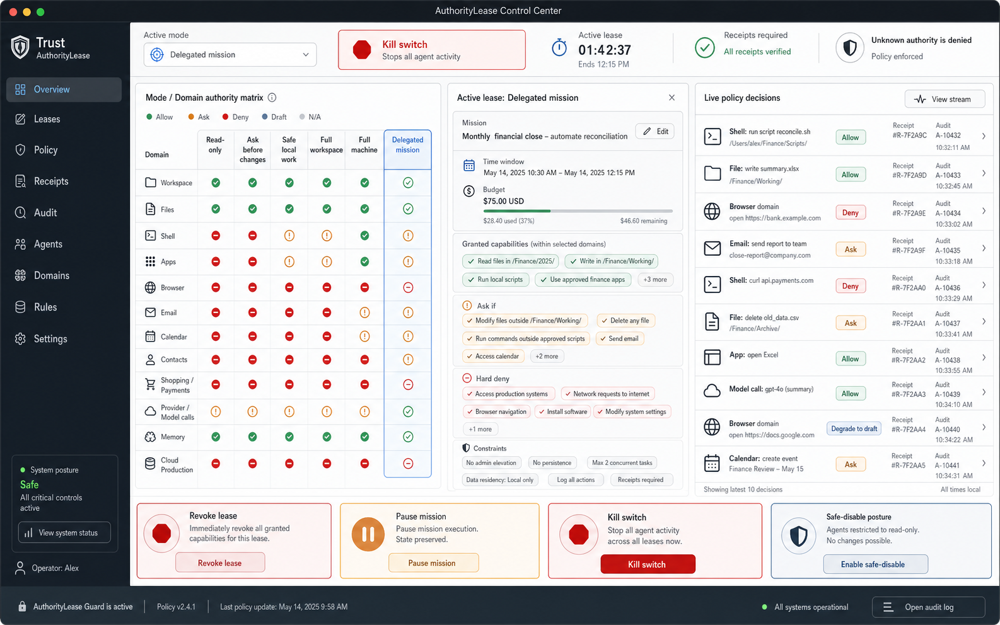
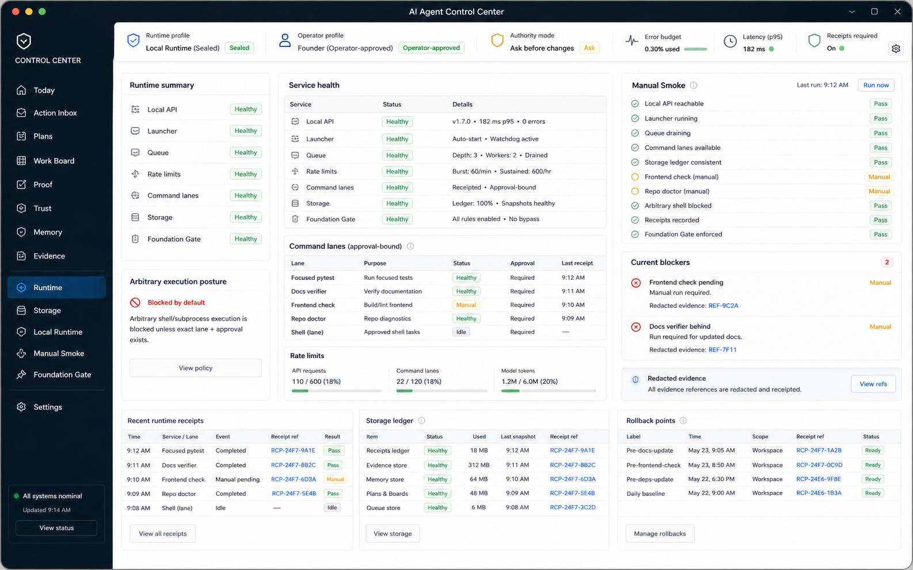

# Control Center North-Star Visual Renders

Status: current design target, documentation only.
Baseline ID: CC-NS-2026-07-06.
Current as of: 2026-07-06.
Repo baseline: v0.104.0 / 0.104.0.

These renders define the desired visual direction for the Control Center as a
contained operator cockpit. They are not shipped UI evidence, runtime behavior,
route proof, authority grant, public beta claim, or production readiness claim.

The canonical rules extracted from this directional set now live in
`../CONTROL_CENTER_UI_UX_SPEC.md` (`CC-UIUX-2026-07-11`). That specification
wins when the generated PNGs disagree with each other. The complete next-render
queue, including all 40 routed surfaces and applicable state/responsive
variations, lives in `RENDER_VARIATION_MATRIX.md`.

The package is meant to remove ambiguity before implementation. Each render is
a bounded desktop-app target for one or more Control Center surfaces, with the
route coverage recorded in `SURFACE_COVERAGE.md`.

The static shell source of truth is `APP_SHELL_BASELINE.md`. If a generated
render shows a different left-rail order, a missing global item, a route-local
tab in the global rail, or a typography mismatch, `APP_SHELL_BASELINE.md`
wins.

## Design Posture

- The Control Center should feel like a native desktop cockpit, not a webpage.
- Every primary workflow should fit in a single application window.
- Use a fixed left navigation rail, a persistent top status/authority strip,
  bounded split panes, compact inspectors, and bottom evidence/receipt bands.
- Avoid endless scrolling, landing-page heroes, oversized marketing cards,
  decorative gradients, or raw JSON as the primary operator view.
- Guardrails should appear as useful context: active mode, required domain,
  approval state, receipt refs, audit refs, rollback/safe-disable posture, and
  blocked/planned state.
- Authority should be represented through trust mode, domain, lease,
  constraints, receipts, audit, redaction, safe-disable, and kill switch.
- Unsupported domains should be visible as unsupported, planned, draft-only, or
  blocked rather than hidden or implied as live.
- No render implies broad shell, browser, connector, provider, background, or
  production authority.

## Render Inventory

| Render | Primary surface group |
|---|---|
| `renders/01_today_command_center.png` | Today, Morning Briefing, daily loop |
| `renders/02_action_inbox_approval_envelope.png` | Action Inbox, approval envelopes, approvals |
| `renders/03_plans_work_board.png` | Plans and Work Board |
| `renders/04_trust_authority_lease.png` | Trust and AuthorityLease cockpit |
| `renders/05_evidence_proof_receipts.png` | Evidence, Proof, Receipts |
| `renders/06_memory_review_context_manifest.png` | Memory review and context manifest |
| `renders/07_setup_runtime_readiness.png` | Setup Assistant and runtime readiness |
| `renders/08_coding_cockpit.png` | Governed Coding cockpit |
| `renders/09_source_inbox_crm_briefing_prep.png` | Source Inbox, CRM, Briefing preparation |
| `renders/10_chat_handoff.png` | Chat and loop handoff |
| `renders/11_start_overview_dashboard.png` | Start Here, Overview, Dashboard |
| `renders/12_settings_authority_profiles.png` | Settings and authority profile controls |
| `renders/13_models_readiness.png` | Models, local runtime, provider posture |
| `renders/14_files_context_proposals.png` | Files, File Review, Context Proposals |
| `renders/15_action_preview_preflight.png` | Action Preview and approval preflight |
| `renders/16_runtime_storage_manual_smoke.png` | Runtime, Storage, Local Runtime, Manual Smoke |
| `renders/17_future_domain_governance.png` | Remote Workers, Plugin Governance, Mobile Planning |
| `renders/18_private_trial_packet.png` | Trial Packet and private review |
| `renders/19_operator_loop.png` | Operator Loop and readable proof spine |
| `renders/20_api_foundation_events.png` | API Routes, Foundation Gate, Events, Differentiators |

## Current Baseline

- Current render set: CC-NS-2026-07-06.
- Current as of: 2026-07-06.
- Canonical shell: `APP_SHELL_BASELINE.md`.
- Route coverage: `SURFACE_COVERAGE.md`.
- Render constraints: `RENDER_MANIFEST.md`.
- Canonical UI/UX specification: `../CONTROL_CENTER_UI_UX_SPEC.md`.
- Complete render queue: `RENDER_VARIATION_MATRIX.md`.

Known generated-render limitation: the screenshots are directional UI renders,
so small sidebar text/order variations inside individual PNGs are not
normative. The global navigation and typography are governed by the shell
baseline.

## Preview Strip

## Implementation Use

When a route is redesigned, use the mapped render in `SURFACE_COVERAGE.md` as
the visual target, then preserve the repo's normal contract-first path:

- backend-owned truth for operator-critical state;
- CLI/API inspection parity for mutating or authority-relevant workflows;
- route side-effect classification;
- OpenAPI/API manifest alignment;
- redacted receipts/evidence;
- focused frontend and Python verifier coverage.

If implementation diverges from a render, update this package or record the
accepted reason in the relevant route docs. Do not let visual assets become
stale hidden requirements.
