# Product North Star

Status: active product north-star visual target
Baseline: v0.104.0 / 0.104.0
Scope: documentation-only visual direction

These screenshots are the current product north star and visual target. The
current UI is not yet close to these images. They are not implementation
evidence by themselves.

The current implementation truth remains governed by route/API contracts,
tests, verifiers, product-truth docs, and redacted evidence. Any gap between
these images and the implemented Control Center must stay labeled as partial,
planned, blocked, mock-only, or intentionally out of scope until the matching
core/API/UI path is implemented and verified.

## Current UI Gap

The north-star images are ahead of the current Control Center UI. Treat them as
product direction for future implementation passes, not as a screenshot gallery
of what currently runs locally. For current static visual-test snapshots, use
[SCREENSHOTS.md](SCREENSHOTS.md).

This document adds no runtime authority, backend route, frontend behavior,
dependency, connector runtime, provider/model call, shell/subprocess behavior,
browser automation, public beta, public distribution, production readiness, or
production authority.

## North-Star Principles

- Founder Command Center is the first-party product shell.
- Today is the first operating surface.
- Action Inbox is the approval-envelope cockpit.
- Memory is governed recall, not truth or authority.
- Evidence is readable history of proposals, approvals, receipts, blocks, and
  corrections.
- Plans create reviewable action envelopes; they do not imply execution.
- Chat is local and non-authoritative until handed off into reviewable
  Plans/Actions surfaces.
- Settings exposes runtime boundaries, permission posture, kill switch, source
  readiness, privacy, and blocked authority modes.
- Setup Assistant is a truthful readiness checklist with dry-run previews.
- The right-side inspector should consistently expose route refs, side-effect
  class, exact scope, approval requirement, evidence refs, idempotency posture,
  rollback or safe-disable posture, blocked capabilities, and review history.
- Top-level posture chips should communicate API boundary, local runtime,
  blocked sources, and evidence health.

## Surface Targets

### Today

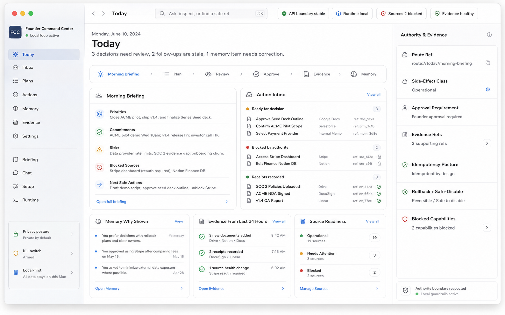

What the design communicates: Today is the daily operating surface. It brings
Morning Briefing, Action Inbox, Memory Why Shown, recent Evidence, source
readiness, and authority posture into one readable cockpit.

Current repo truth: partial. The Today spine and first Today-to-Action receipt
loop exist, but the broader daily workflow, source integrations, notifications,
and full product-readiness claim remain incomplete.

Safety notes: Today can summarize safe refs and review posture, but it does not
grant connector authority, external writes, hidden context injection, model
authority, or production authority.

### Action Inbox

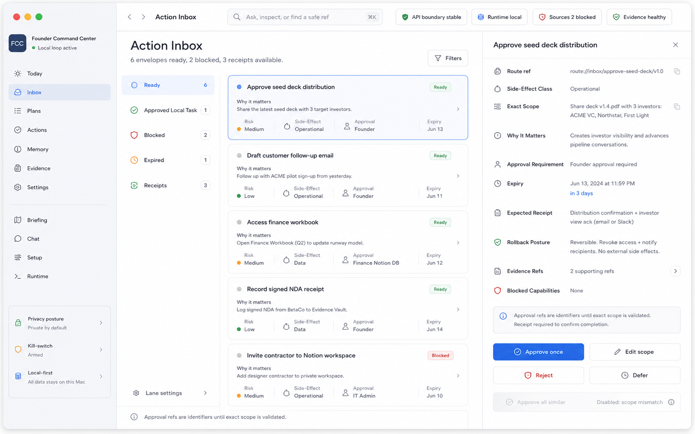

What the design communicates: Action Inbox is the approval-envelope cockpit.
Every proposal should make exact scope, side-effect class, risk, approval
requirement, expiry, expected receipt, rollback posture, evidence refs, and
blocked capabilities visible before any decision.

Current repo truth: implemented with narrow scope. Backend-owned
approve/edit/reject/defer decision state and one exact approved local-task lane
exist. Broad action execution remains blocked.

Safety notes: Approval refs are identifiers until exact
`LocalApprovalAuthority` scope is validated. Generic execution, connector
writes, shell/subprocess work, model/provider authority, external side effects,
and production authority remain blocked.

### Memory

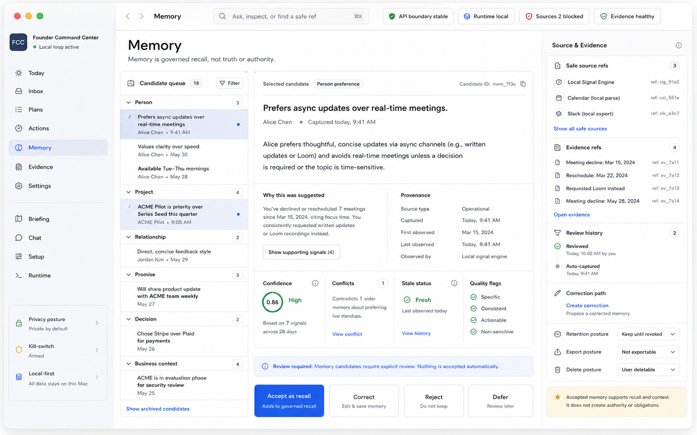

What the design communicates: Memory should feel like a review desk for
governed recall, with why-shown explanations, provenance, safe source refs,
evidence refs, confidence, conflicts, review history, correction paths,
retention posture, and explicit accept/correct/reject/defer decisions.

Current repo truth: implemented with narrow scope. Memory Review receipts,
reviewed recall-only records, L1/L2/L3 read-only indexes, proposal-only context
packs, and internal Action proposal receipts exist for exact reviewed refs.

Safety notes: Memory is recall, not truth or authority. Memory does not grant
context injection, CRM/account sync, connector writes, action execution,
provider/model authority, or production authority.

### Evidence

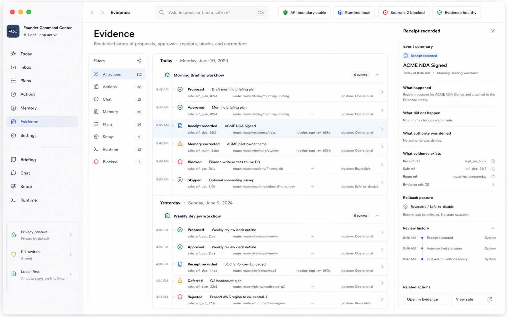

What the design communicates: Evidence is readable history. It should show what
was proposed, approved, recorded, corrected, blocked, skipped, rejected, and
why, while keeping receipt refs, safe refs, route refs, rollback posture, and
review history visible.

Current repo truth: implemented for bounded proofed route surfaces. The
Evidence Timeline productization exists for safe-ref proposal, decision,
receipt, Chat, handoff, and Memory Review events.

Safety notes: Evidence is read-only review material. It uses safe refs and
redacted summaries only. Timeline refs do not grant approval authority,
rollback execution, connector runtime, context injection, action execution, or
production authority.

### Plans

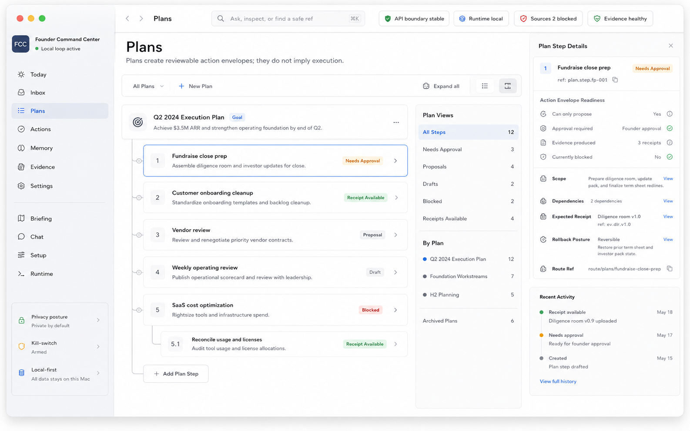

What the design communicates: Plans organize work into reviewable steps and
show when a step can propose an Action envelope, needs approval, has evidence,
is blocked, or has receipt history.

Current repo truth: partial. Planning and Action-envelope posture exist, and
Chat/Today can create reviewable proposal refs, but the broader product Plans
workflow remains incomplete.

Safety notes: Plans create reviewable proposals only unless a later exact
scope grants action authority. Plans do not imply execution, connector writes,
shell/subprocess work, provider/model authority, or production authority.

### Chat

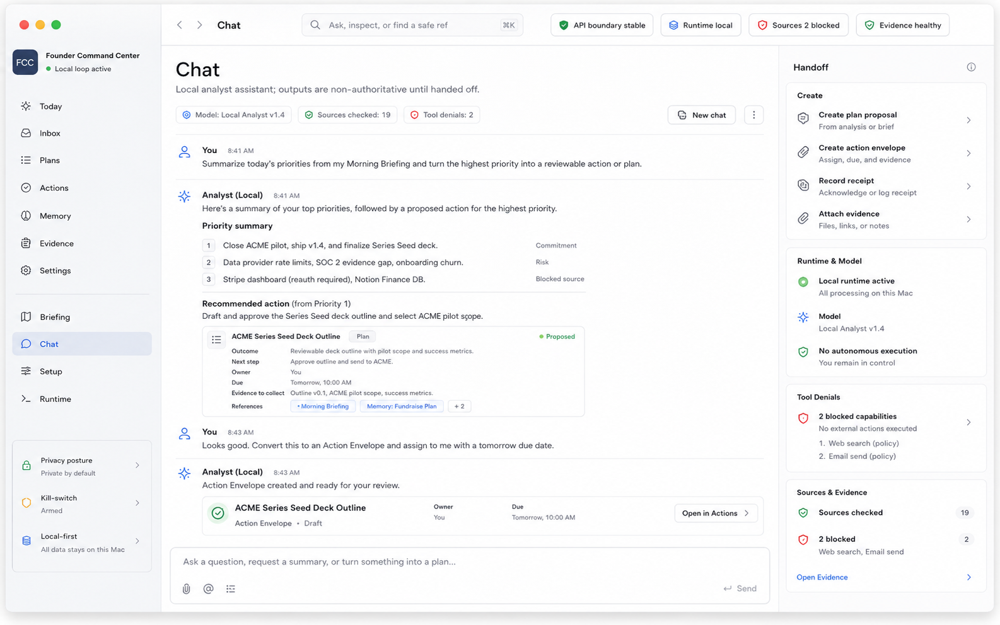

What the design communicates: Chat is a local analyst surface whose outputs
remain non-authoritative until handed off into reviewable Plans/Actions. Tool
denials, source checks, runtime posture, and handoff options should be visible.

Current repo truth: implemented with narrow scope. Durable safe Chat turn
receipts and reviewable Actions/Plans handoff receipts exist. Handoffs do not
execute.

Safety notes: Model output is not truth, approval evidence, memory authority,
or execution authority. Chat does not grant connector writes, hidden context
injection, provider authority, generic action execution, or production
authority.

### Settings

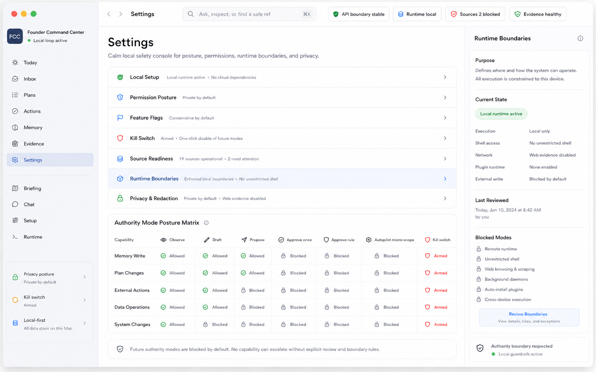

What the design communicates: Settings is the safety console. It should expose
local setup, permission posture, feature flags, kill switch, source readiness,
runtime boundaries, privacy/redaction, authority-mode posture, and blocked
modes.

Current repo truth: partial/status. Backend-owned read-only status and
review-only proposal posture exist. Mutating feature flags, kill-switch
execution, runtime setting changes, and model lifecycle actions remain future
scoped.

Safety notes: Settings can show posture and proposal refs, but it does not
grant runtime authority, unrestricted shell/network/browser access, connector
writes, plugin execution, background daemons, cross-device execution, or
production authority.

### Setup Assistant

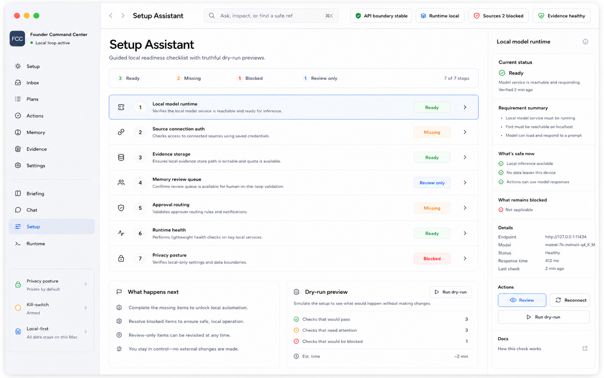

What the design communicates: Setup Assistant is a truthful local readiness
checklist. It should distinguish ready, missing, blocked, and review-only
steps, show dry-run previews, and explain what is safe now versus what remains
blocked.

Current repo truth: partial/readiness surface. Setup preview and dry-run
approval-envelope metadata exist; setup mutation authority remains blocked.

Safety notes: Dry-run setup previews do not install, download models, create
background services, mutate credentials, execute rollback, grant public
distribution, or grant production authority.

### Social Media Intelligence (Dependency-Gated Future Target)

What the design communicates: Social is a creator-focused interpretation layer
for performance, audience, campaigns, cadence, and high-signal conversations.
It routes work into the existing canonical owner instead of rebuilding the
Calendar, Kanban board, inbox, CRM, or Studio.

| Calendar owns time | Work Board owns production | Communications owns conversations |
|---|---|---|
| 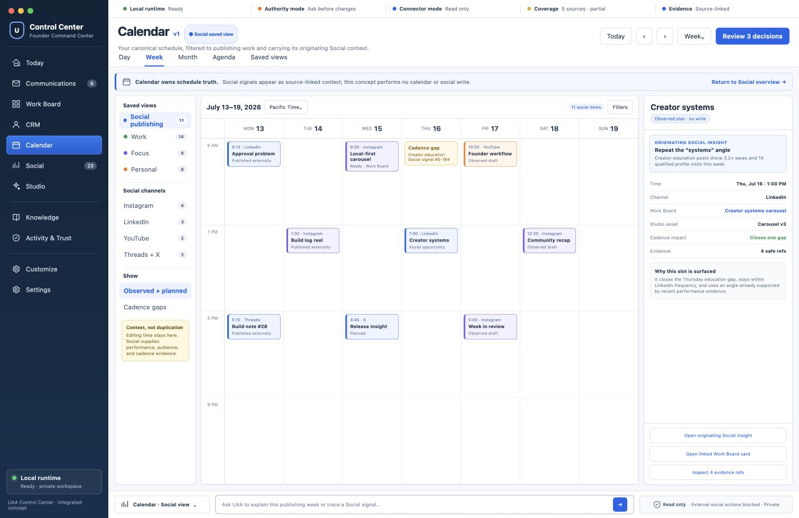 | 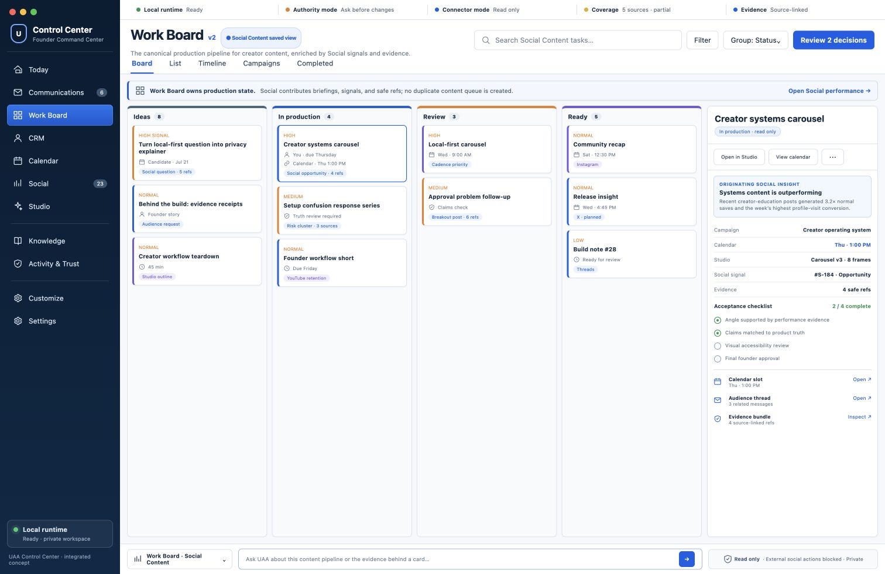 | 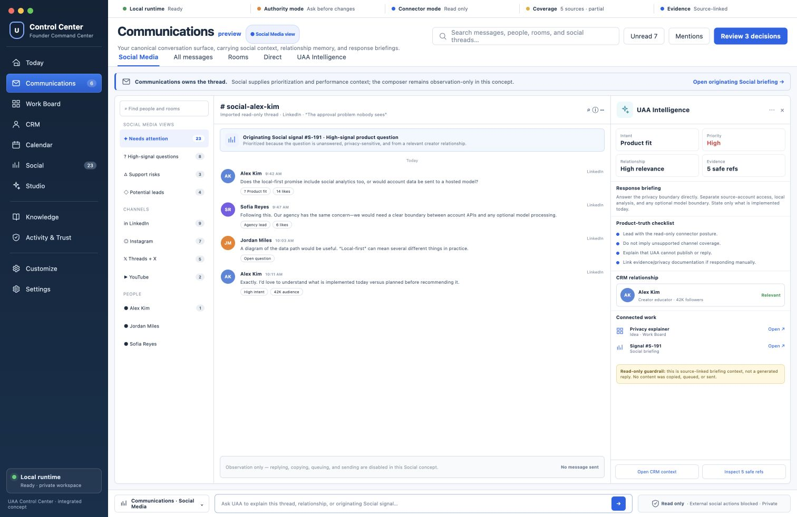 |

Current repo truth: planned and deferred. The product contract, labels,
ownership model, render pack, and future execution prompt are accepted planning
artifacts. No Social route, read model, API, CLI, frontend behavior, connector,
publishing, reply, or background sync is implemented by those artifacts.

Recommendation gate: Social must not be proposed as the next implementation
lane until Work Board/Kanban, first-class CRM, and Communications/Messenger are
all accepted as fully implemented. Passing those gates makes Social eligible,
not automatically next.

Safety notes: The initial milestone is read-only. See the
[product contract](../product/UAA_SOCIAL_MEDIA_INTELLIGENCE_PRODUCT_CONTRACT.md),
[render pack](../design/control_center_north_star/renders/social-media-v1/README.md),
and
[future implementation prompt](../prompts/implement_social_media_intelligence_after_foundation_gates.prompt.md).

## Non-Goals

This north-star packet does not add or imply:

- production authority
- public beta, public release, or public distribution
- broad autonomy
- connector writes
- generic action execution
- shell/subprocess authority
- unrestricted browser or network authority
- provider/model authority
- hidden context injection
- plugin runtime import or execution
- UI-only product truth

Use [CURRENT_STATUS.md](CURRENT_STATUS.md) for current implementation state and
[PRODUCT_RELEASE_TRUTH_PACKET.md](../roadmap/PRODUCT_RELEASE_TRUTH_PACKET.md)
for release-facing product truth.
