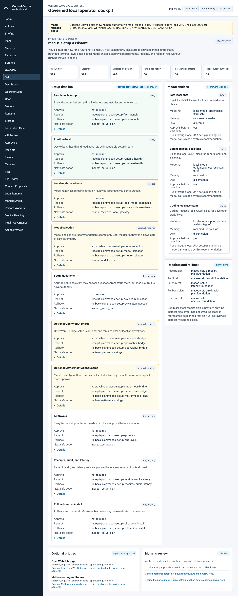
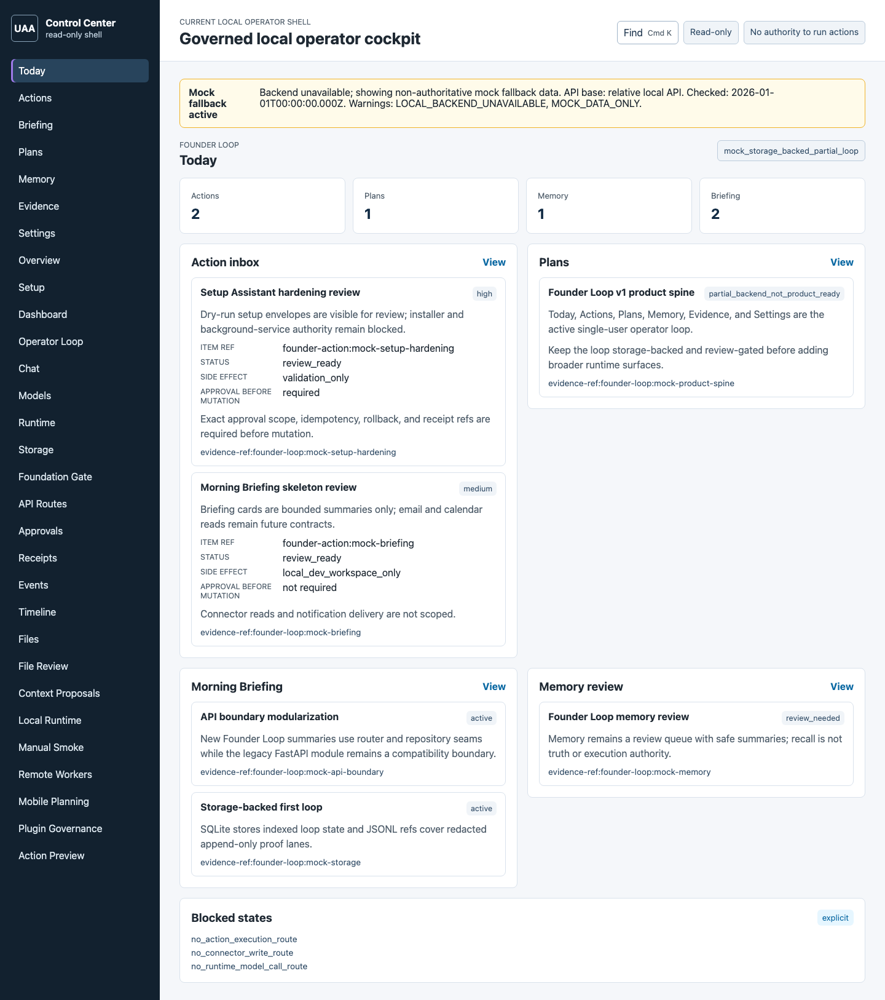
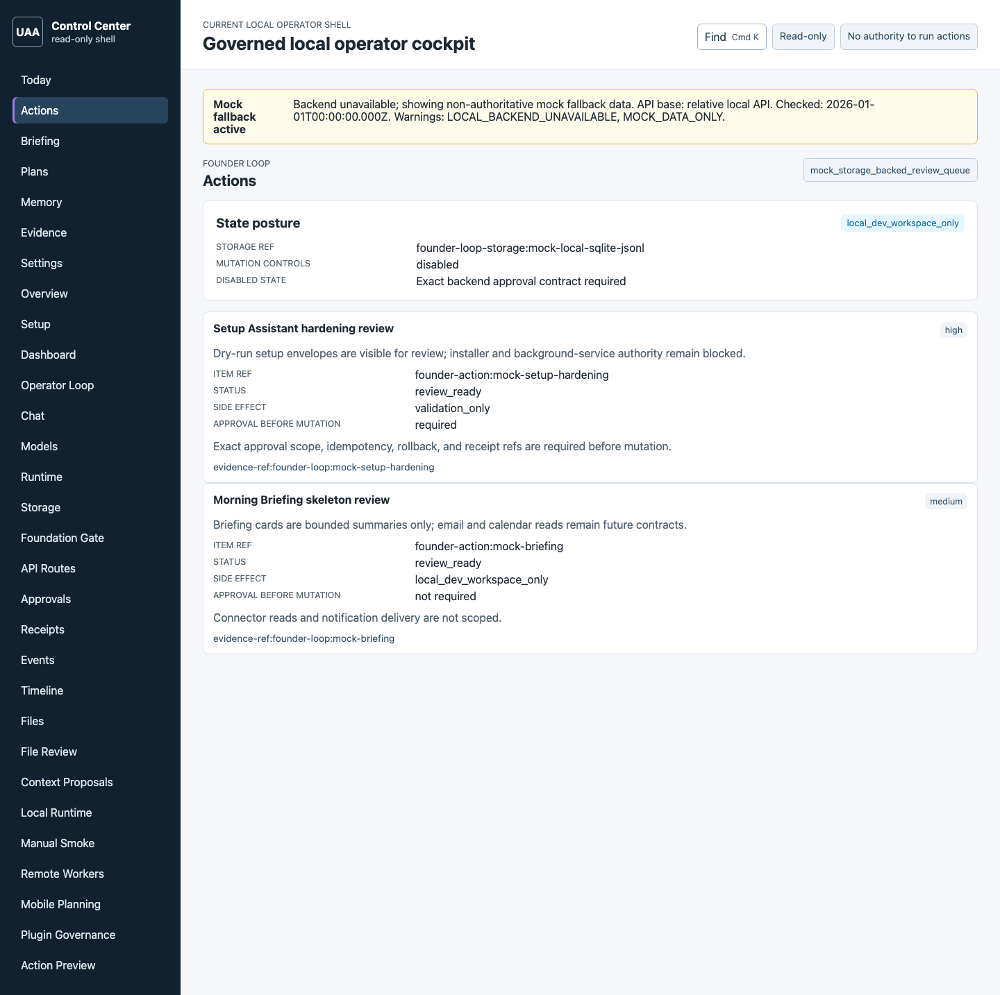
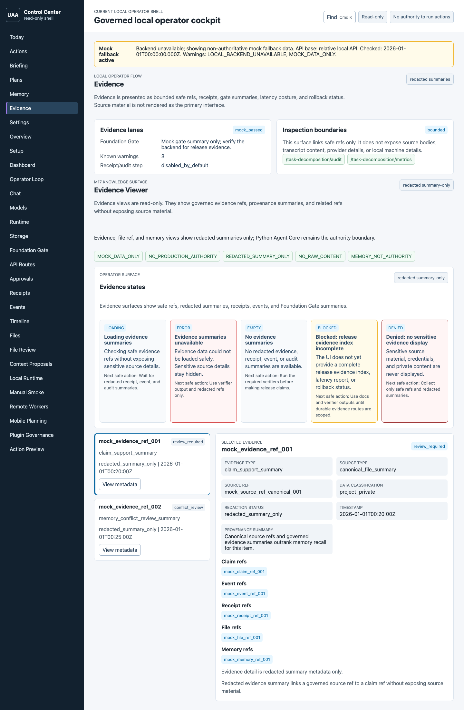
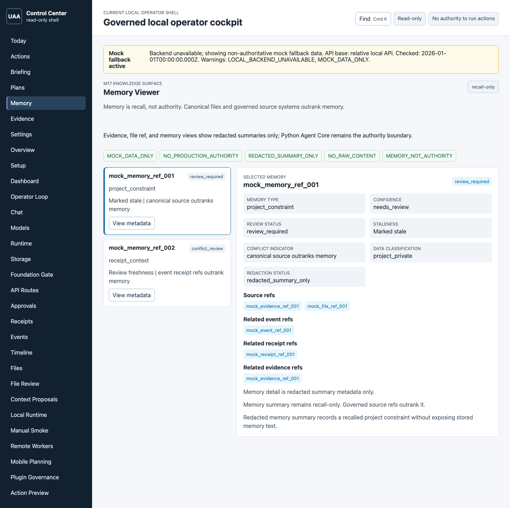

# Portfolio Screenshots

Status: static visual-test snapshot gallery
Scope: documentation-only portfolio preview

These images are existing Control Center visual regression snapshots copied
from `apps/control-center/tests/visual/__snapshots__/desktop/` into a
portfolio-friendly docs asset folder.

They are sanitized visual-test snapshots of the local Control Center shell.
They are not production screenshots, public beta evidence, public distribution
evidence, or claims that every displayed workflow is complete. Several views
intentionally show mock/degraded fallback, read-only posture, blocked
authority, and safe-ref-only states.

For the current product direction, see
[PRODUCT_NORTH_STAR.md](PRODUCT_NORTH_STAR.md). North-star screenshots are
visual targets only; they are not implementation evidence by themselves, and
the current UI is not yet close to them.

## Gallery

### Setup Assistant

Dry-run setup posture, model-choice preview, receipt/rollback refs, and blocked
installer authority.

### Today

Founder Loop overview showing Action Inbox, Plans, Morning Briefing, Memory
Review, and explicit blocked states.

### Action Inbox

Review queue posture for safe Action proposals. Generic execution and external
authority remain blocked unless backend-owned exact scope and approval exist.

### Evidence

Safe-ref Evidence view with redacted summaries. Source bodies, raw logs,
credentials, provider payloads, and private content are not displayed.

### Memory

Recall-only memory viewer that keeps canonical sources and governed evidence
above memory recall.

### CRM

No portfolio snapshot is checked in for the partial backend-owned `/crm` local
command center yet. The route remains blocked from visual-proof promotion until
a scoped visual pass captures a sanitized baseline or records an accepted
no-baseline rationale.

## Snapshot Boundaries

- Static visual-test snapshots only.
- No backend route, frontend control, runtime authority, connector runtime, or
  product behavior is added by this gallery.
- Missing snapshots do not imply the route is unavailable, shipped, production
  ready, or visually proofed.
- Mock/degraded UI state remains mock/degraded UI state.
- Memory is recall, not truth or authority.
- Approval refs are identifiers until exact backend scope is validated.
- Evidence uses safe refs and redacted summaries only.
